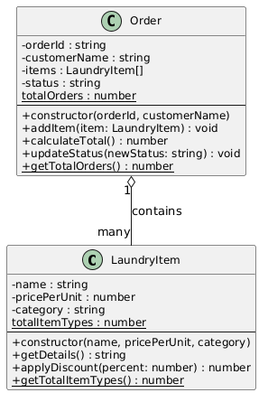

# Laundry Management System

## Problem Domain Description

The **Laundry Management System** allows laundry service providers to manage customer orders by tracking laundry items, calculating costs, and monitoring order status from submission to delivery. It solves the problem of manual order tracking and pricing errors by automating the workflow for laundry businesses. The system is used by laundry shop operators and staff to efficiently process and manage customer laundry requests.

---

## UML Class Diagram



---

## How to Run

```bash
node src/index.js
```
